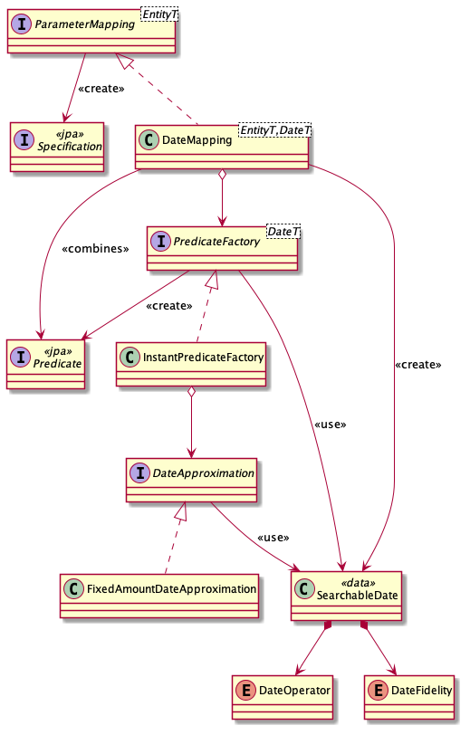

# Vulcan

_Vulcan_ provides simplified HTTP to DB query support. It is heavily influenced by FHIR search parameter semantics. See http://hl7.org/fhir/R4/search.html. _Vulcan_ allows simple mapping from HTTP request parameters to JPA searches using Spring Data.

## How do I use it?

#### 1. Define a JPA entity.

```
@Data
@EqualsAndHashCode(onlyExplicitlyIncluded = true)
@Entity
@Table(name = "FOO")
public class FugaziEntity {
  @Id @GeneratedValue @Column @NotNull @EqualsAndHashCode.Include long id;
  @Column @NotNull String name;
  @Column @NotNull String food;
  @Column @NotNull Instant date;
  @Column String payload;
}
```

##### 2. Define a Spring Data repository

The repository must implement `JpaSpecificationExecutor` and can otherwise be empty.

```
public interface FugaziRepository extends 
    CrudRepository<FugaziEntity, String>,
    JpaSpecificationExecutor<FugaziEntity> {}
```

#### 3. Create a REST controller with mappings

Your request method will need the `HttpServletRequest`. Create `Vulcan` instance and `forge` a request to process the HTTP parameters and execute database queries. The list of JPA entities returned can be transformed in any way necessary to be returned.

```
@RestController
@RequestMapping(
    value = {"/fugazi"},
    produces = {"application/json"})
public class FugaziController {

  @Autowired FugaziRepository repo;

  /* You'll need to configure Vulcan. */
  private VulcanConfiguration<FugaziEntity> configuration() {
    return VulcanConfiguration.forEntity(FugaziEntity.class)
        .paging(
            PagingConfiguration.builder()
                .pageParameter("page")
                .countParameter("count")
                .defaultCount(30)
                .maxCount(100)
                .sort(Sort.by("id").ascending())
                .baseUrlStrategy(useUrl("http://vulcan.com"))
                .build())
        .mappings(
            Mappings.forEntity(FugaziEntity.class)
                .string("name")
                .csvList("food")
                .value("millis", v -> Instant.parse(v).toEpochMilli())
                .dateAsInstant("when", "date")
                .get())
        .build();
  }


  @GetMapping
  public ResponseEntity<List<FugaziDto>> get(HttpServletRequest request) {
    // Invoke Vulcan to perform determine and perform the approriate query
    var result = Vulcan.forRepo(repo).config(configuration()).build().forge(request);

    // Process the entities anyway you want. Here we'll map them a DTO.
    var body = result.entities().map(this::asFoo).collect(toList());
    var response = ResponseEntity.ok(body);

    // Enhance your response with paging information anyway you want.
    // I'll just add some headers, but you could do whatever.
    var headers = response.getHeaders();
    result.paging().firstPageUrl().ifPresent(url -> headers.add("X-FIRST-PAGE", url));
    result.paging().previousPageUrl().ifPresent(url -> headers.add("X-PREVIOUS-PAGE", url));
    result.paging().thisPageUrl().ifPresent(url -> headers.add("X-THIS-PAGE", url));
    result.paging().nextPageUrl().ifPresent(url -> headers.add("X-NEXT-PAGE", url));
    result.paging().lastPageUrl().ifPresent(url -> headers.add("X-LAST-PAGE", url));
    return response;
  }
}
```

## Error Handling

`InvalidParameter` exceptions will be thrown if an HTTP request parameter cannot be used. For example, it's specified as value that cannot be parsed as data when used with a date mapping. Such exceptions should be considered a client error. An HTTP `400` Bad Request response is appropriate.

## Mappings

_Vulcan_ provides several mappings and allows you to add your own with the `Mapping` interface. The `Mappings` utility provides easy helpers for common mappings with convenience methods for matching the HTTP request parameter to the JPA field name. Different mappings have different types of semantics. Some can be repeated, and some can allow the HTTP parameter to be specified in different ways.

##### Examples

| Mapping | HTTP Request Parameter | JPA Field Name | Use |
| ------- | ---------------------- | -------------- | --- |
| `string("name")`                   | name  | name | `name=vulcan`
| `string("id","name")`              | id    | name | `name:contains=can`
| `dateAsInstant("date")`            | date  | date | `date=gt2005&date=le2006`
| `csvList("foods","food")`          | foods | food | `food=NACHOS,TACOS`
| `value("id",v->Integer::parseInt)` | id    | id   | `id=123`

### `string("name")` and `string("name","field")`

- Matches `String` field values.
- Supports FHIR semantics for string parameters. See http://hl7.org/fhir/R4/search.html#string
    - `name=vul` - Starts with
    - `name:contains=ulca` - Contains
    - `name:exact=Vulcan` - Exact
- Case-sensitivity for string parameters depends on database configurations

For the JPA field value of `Vulcan`, here's how the following parameters match.

| Parameter | Matches |
| --------- | ------- |
| `name=Vul`           | yes |
| `name=Vulcan`        | yes |
| `name=can`           | no  |
| `name:contains=ulca` | yes |
| `name:exact=Vulcan`  | yes |

### `csvList("name")` and `csvList("name","field")`

- Matches `String` fields values.
- Set of possible values can be specified with simple CSV notation.
- Uses "exactly any of" semantics when matching. Matches are case-sensitive.

For a table with the following values:

| ID | FOOD |
| -- | ------ |
| 1 | Nachos |
| 2 | Tacos |
| 3 | A Shoe |
| 4 | Nachos |

The parameter `food=Nachos,Tacos` will result in records 1, 2, and 4 being returned. The parameter `food=NACHOS` will result in no records.

### `value("name",function)` and `value("name","field",function)`

- Matches any type of field, but requires a converter `Function<String,?>` to translate the HTTP request value. The converter can be used to map a public ID to an internal ID, adjust case, or any transformation needed.
- Uses "equals" semantics.

For example, values could be converted to an enumeration or a number.

```
.value("type",v->Thing.valueOf(v.toUpperCase(Locale.US)))
.value("age",Integer::parseInt)   
```

### `values("name",function)`

- Matches any type and any number of fields, but requires a converter `Function<String,Map<String,?>>` to translate the request HTTP value into a mapping of field names and values. The converter can be used to split a single value into values over multiple columns that are combined with AND semantics.
- Uses "equals" semantics ANDed together for each column

For example, values can be used map an ID to two columns.

```
.values("id",this::idAndTypeValues)

// meanwhile ...

Map<String,?> idAndTypeValues(value) {
  if (value.length() < 2) {
    throw InvalidRequest.badParameter(
      "id",
      value,
      "format is one char for type followed by an item number, e.g. a123");
  }
  return Map.of("type",value.charAt(0),"itemNumber",value.substring(1));
}
```

### `dateAsInstant("name")` and `dateAsInstant("name","field")`

- Matches `Instant` type fields.
- Can be specified twice to produce a range.
- Supports FHIR sematics for date processing using 9 prefixes. See http://hl7.org/fhir/R4/search.html#prefix and http://hl7.org/fhir/R4/search.html#date

Date formats

- `YYYY` - year only (`2005`)
- `YYYY-MM` - year and month (`2005-01`)
- `YYYY-MM-DD` - year, month, or day (`2005-01-21`)
- `YYYY-MM-DD'T'HH:MM:SS` - precise time (`2005-01-21T07:57:00`)
- `YYYY-MM-DD'T'HH:MM:SSZ` - precise time in UTC (`2005-01-21T07:57:00Z`)
- `YYYY-MM-DD'T'HH:MM:SS??HH:MM` - precise time with a specified zone offset (`2005-01-21T07:57:00-04:00`)

The server's local time zone is used for dates without a time zone.

Prefix

- `eq` - equals
- `ne` - not equals
- `gt` - greater than
- `ge` - greater than or equal to
- `sa` - starts after (same as `gt`)
- `lt` - less than
- `le` - less than or equal to
- `eb` - ends before (same as `lt`)
- `ap` - approximately

##### Approximate dates

Date approximation can be customized, but the default behavior depends on the fidelity of the search. The specified date value is expanded by the following number of days creating a range based on the format of the date.

- Year only - 365 days
- Year and month - 30 days
- Year, month, and day - 3 days
- Precise time - 1 day

Examples

- `date=ap2006` will search `2005-01-01T00:00:00.000` to `2007-12-31T23:59:59.999`
- `date=ap2005-01` will search `2004-12-02T00:00:00.000` to `2005-03-02T23:59:59.999`
- `date=ap2005-01-21` will search `2005-01-18T00:00:00.000` to `2005-01-24T23:59:59.999`

### In the weeds with `DateMapping`

The `DateMapping` class allows for extensible customization. It divides the responsibility into the following categories:

- Parameter parsing and normalization
- Field-specific JPA `Predicate` creation (different types of fields require different operators)
- Date approximation



- `DateMapping` provides orchestration for of the different components, but does little work itself.
- `SearchableDate` provides parameter parsing and normalizes values as `Instant`, determines `DateOperation`,and `DateFidelity` of the search.
- `PredicateFactory` creates the JPA `Predicate` instances for a specific field type (or class). For example, the `InstantPredicateFactory` is suitable for JPA entities with `Instant` parameters. It cannot work with other types, such as epoch millis stored as `long` values. In that case a `LongPredicateFactory` is required.
- `DateApproximation` provides logic for expanding the search parameter values. A preconfigured `FixedAmountDateApproximation` instance is available to be used as a default choice.

### `reference(name, fieldNameSelector, defaultResourceType, allowedResourceTypes, supportedReference, valueSelector)`

- `name [String]`: the parameter name
- `fieldNameSelector [Function<ReferenceParameter, Collection>]` : Function responsible for selecting the appropriate searchable DB column
- `defaultResourceType [String]` : a resource type that will be used in all non-type-modified queries
- `allowedResourceTypes [Set<String>]` : the set of allowed reference types as per the specification
- `supportedReference [Predicate<ReferenceParameter>]` : Predicate that determines validity of your token via your own custom criteria (e.g. resource type validation, base-url validation, etc...)
- `valueSelector [Function<ReferenceParameter, String]` : translate public ids to searchable values

For a database with the following values:

| ID | FOOD | | -- | ------ | | 1 | Nachos1 | | 2 | Tacos1 | | 3 | Shoe1 | | 4 | Nachos2 |

Consider these examples:

Mapping: \
`.reference("foodreference", "food", "mexican", Set.of("mexican"), foodReferenceIsSupported(), foodReferenceValues())`

Request: `/fugazi?foodreference=1`\
Result: `Nachos1`

Request: `/fugazi?foodreference=2`\
Result: `Tacos1`

Request: `/fugazi?foodreference=3`\
Result: `Shoe1`

Request: `/fugazi?foodreference=4`\
Result: `Nachos2`

Request: `/fugazi?foodreference:mexican=1`\
Result: `Nachos1`

Request: `/fugazi?foodreference=mexican/2`\
Result: `Tacos1`

Request: `/fugazi?foodreference=https://good.com/mexican/4` \
Result: `Nachos2`

Request: `/fugazi?foodreference:japanese=1`\
Result: `Invalid Request`
Type japanese not allowed, as per the spec.

Mapping: \
`.reference("foodreference", "food", "mexican", Set.of("mexican", "japanese"), foodReferenceIsSupported(), foodReferenceValues())`

Request: `/fugazi?foodreference=1`\
Result: `Invalid Request` \
Must use a type-modified search on a reference that has more than 1 supported type

Request: `/fugazi?foodreference:mexican=1`\
Result: `Nachos1`

Request: `/fugazi?foodreference=mexican/2`\
Result: `Tacos1`

Request: `/fugazi?foodreference=https://good.com/mexican/4` \
Result: `Nachos2`
